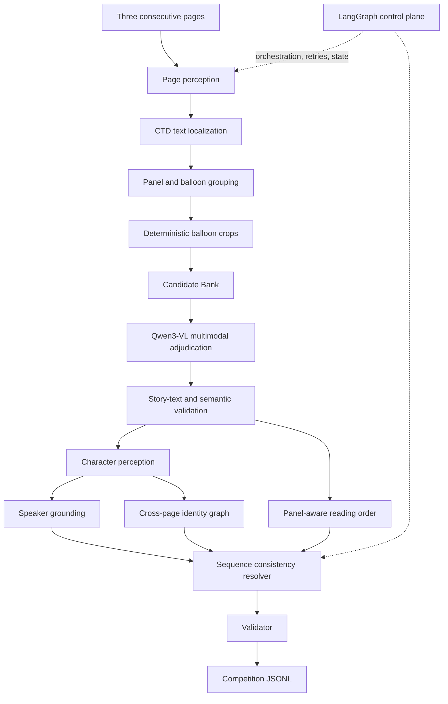

# STORY-AI


Research-engineering pipeline for extracting story text, reading order, speaker attribution, and sequence-local character identity from three consecutive English manga pages.


## Research problem

Manga understanding is not generic OCR. Text may be vertical, rotated, fragmented across a balloon, mixed with sound effects, embedded in complex panel layouts, or visually associated with a character elsewhere in the scene. A useful system must solve localization, recognition, semantic filtering, ordering, grounding, and identity consistency as separate but connected problems.

The competition output is sequence-scoped JSONL. Character labels are anonymous within each three-page sequence; they are not global names.

## Locked architecture



LangGraph remains the orchestration/control plane. It manages state, routing, retries, dependencies, parallel page execution, and diagnostics; it does not replace specialized component models.

| Layer | Responsibility | Current implementation |
|---|---|---|
| Localization | Find text-bearing regions without assuming language metadata is reliable | Comic Text Detector ONNX |
| Layout | Recover panels, balloons, and CTD-fragment ownership | Manga109 balloon-layout YOLO + geometry fallback |
| Evidence | Preserve independent recognition hypotheses | PaddleOCR, Nemotron, Qwen evidence |
| Adjudication | Decide what the balloon image says and whether it is story text | Qwen3-VL 4B Instruct |
| Character perception | Detect characters and create deterministic crops | RT-DETRv4 + MobileNetV3 |
| Relations | Assign speakers and resolve reading order | Geometry, visual context, panel hierarchy |
| Identity | Keep anonymous labels stable across pages | Sequence-local identity graph |
| Resolution | Reconcile predictions under explicit constraints | Deterministic resolver + validator |

## Candidate Bank and adjudication

The Candidate Bank retains multiple hypotheses per localized region. PaddleOCR, Nemotron, Qwen proposal evidence, preprocessing variants, and fused evidence remain independently traceable. Qwen3-VL adjudicates at balloon level using the image and evidence set and may correct all candidate strings when they are jointly wrong.

## Output contract

```json
{
  "sequence_id": "seq_...",
  "pages": [
    [{"speaker": "A", "text": "..."}],
    [{"speaker": "NARRATION", "text": "..."}],
    [{"speaker": "UNKNOWN", "text": "..."}]
  ]
}
```

`A`, `B`, `C`, ... are sequence-local identity labels. `NARRATION` is for story text without a resolved speaker. `UNKNOWN` preserves unresolved attribution; the system must not fabricate a character label.

## Current baseline

The reference regression baseline is 212/212 tests passing. The recorded real three-page integration baseline reports:

| Measure | Count |
|---|---:|
| Pages | 3 |
| CTD regions | 34 |
| Balloons | 29 |
| Candidate hypotheses | 119 |
| Characters | 31 |
| Resolved speakers | 15 |
| Narration items | 14 |
| Identity clusters | 12 |
| Identity pairs | 318 |
| Reading-order items | 29 |
| Resolver diagnostics | 0 |
| Validation errors | 0 |

Integration PASS is a pipeline and contract baseline, not a competition-accuracy claim. Accuracy is evaluated separately against labelled development data.

## Dataset and evaluation

```text
dataset/
├── development/  labelled three-page sequences and labels.jsonl
├── test/         held-out sequences
├── sequences.json
├── sample_submission.jsonl
└── score.py
```

Development splits must preserve sequence boundaries. The 15 test sequences remain untouched until final prediction. Development evaluation should run the automatic pipeline, score with `dataset/score.py`, and classify errors by text, order, speaker, identity, and serialization validity.

## Setup

The canonical configuration is [config/project.yaml](config/project.yaml). The canonical environment verification entry point is [scripts/setup_project.py](scripts/setup_project.py). It checks Python, uv, the virtual environment, required directories, local model assets, CUDA, WSL, and runtime prerequisites without downloading large weights or touching the dataset.

```powershell
uv sync
.venv\Scripts\python.exe scripts\setup_project.py
.venv\Scripts\python.exe scripts\setup_project.py --check-only
```

Machine-specific locations are supplied through `STORYAI_PADDLE_MODEL_DIR`, `STORYAI_QWEN_CACHE_DIR`, `STORYAI_LAYOUT_WEIGHTS`, `STORYAI_RTDETR_MODEL`, and `STORYAI_NEMOTRON_DIR`.

## Development workflow

```text
change one component → tests → small smoke → full integration →
labelled development evaluation → error taxonomy → targeted change → regression test
```

Run the regression suite with a repository-local temp directory when the Windows temp directory is restricted:

```powershell
.venv\Scripts\python.exe -m pytest -q --basetemp .smoke\pytest
```

The full integration entry point is [tools/pipeline_integration_smoke.py](tools/pipeline_integration_smoke.py). Development scoring uses `dataset/score.py`; do not use test labels during inference.

## Repository map

```text
app/       pipeline components, schemas, models, and control-plane nodes
config/    canonical project configuration
dataset/   development/test images, labels, and scorer
docs/      canonical research notes and preserved historical archives
scripts/   setup and verification entry points
tests/     unit and structural regression tests
tools/     component and end-to-end smoke runners
vendor/    required Comic Text Detector code and assets
assets/    project branding and pipeline illustration
```

## Documentation and research record

- [STORY_AI_DEVELOPMENT_LOG.md](STORY_AI_DEVELOPMENT_LOG.md) — chronological record of problem, hypothesis, experiment, result, interpretation, decision, and next gate.
- [STORY_AI_DECISIONS.md](STORY_AI_DECISIONS.md) — stable architecture and interface decisions.
- [docs/archive/](docs/archive/) — preserved historical versions, including the Laya investigation. Laya is historical evidence only and absent from production architecture.

## Known limitations and open gates

- Nemotron requires a functioning WSL worker and is optional when unavailable.
- Qwen adjudication is the dominant measured runtime cost.
- Integration PASS does not establish competition accuracy.
- The next research gate is labelled development-set evaluation and error analysis, followed by measured runtime instrumentation.
