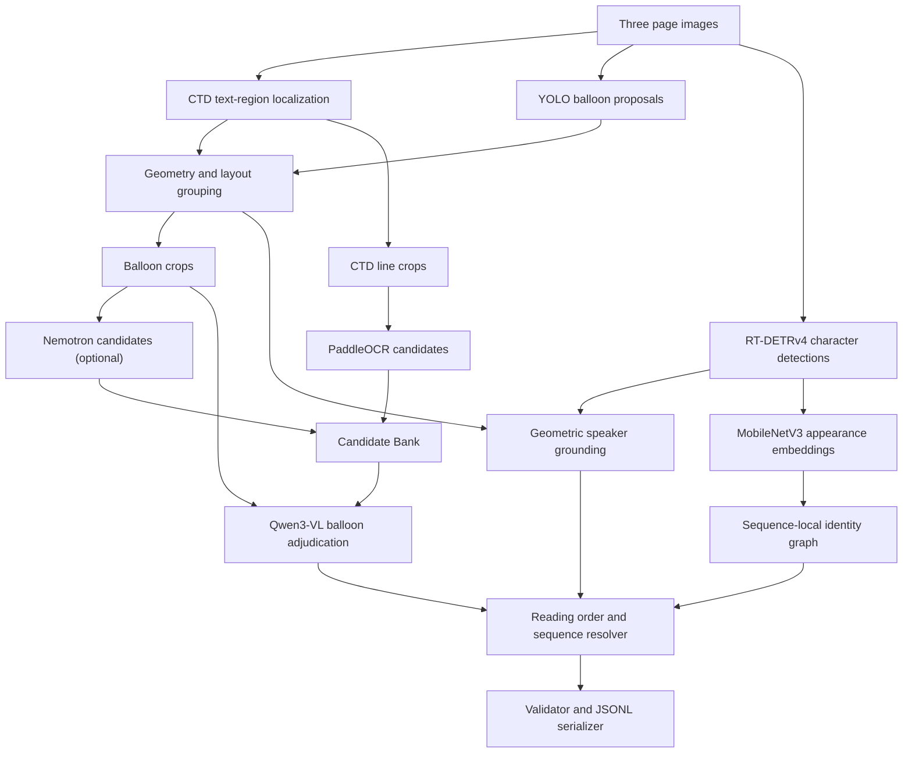
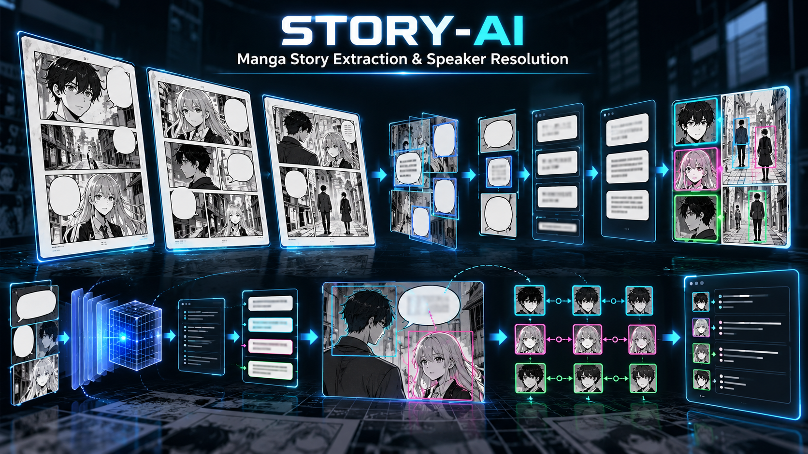

<p align="center">
  
</p>

<h1 align="center">STORY-AI</h1>

<p align="center">Turns three consecutive English manga pages into an ordered JSONL transcript with text and sequence-local speaker labels, using local vision and OCR models.</p>

## Demo

Start the local API, open its interactive documentation, and try a dataset sequence or upload three page images:

[Open FastAPI docs](http://127.0.0.1:8000/docs)

This is a local demo URL; the API must be started using the instructions below. It is not a hosted service.

## Problem and solution

The repository addresses the task of extracting story text from three-page manga sequences while preserving page order and assigning speakers consistently within a sequence. STORY-AI combines text localization, balloon grouping, OCR evidence, image-based adjudication, character detections, and sequence-level reconciliation. It writes the contest-style JSONL structure consumed by `dataset/score.py`.

## Dataset

`dataset/sequences.json` contains **95 sequences**: 80 development sequences with references in `dataset/development/labels.jsonl`, and 15 test sequences without references in this repository. Each sequence has three consecutive page images. `dataset/sample_submission.jsonl` defines the test IDs and output template; `dataset/score.py` scores predictions when matching references are available.

## Key features

- Localize text regions with the vendored Comic Text Detector (CTD) ONNX model.
- Propose speech-balloon masks with a local YOLO segmentation checkpoint and group CTD regions using spatial geometry.
- Produce PaddleOCR line-recognition candidates; optionally use Nemotron OCR through a Windows-to-WSL bridge.
- Use Qwen3-VL to adjudicate each balloon's transcription, text type, and story inclusion from the crop and candidate evidence.
- Detect character bodies and faces, ground likely speakers with spatial evidence, and reconcile anonymous character identities across the three pages.
- Resolve reading order, validate sequence references and submission shape, and serialize JSONL.

## Architecture



The test runner reads the 15 sequence IDs from `dataset/sample_submission.jsonl` and their three image paths from `dataset/sequences.json`. CTD finds text-like regions; the YOLO checkpoint proposes balloon shapes, and the grouping code associates regions with balloons. PaddleOCR proposes text from CTD line crops, while Nemotron can optionally propose text from balloon crops; Qwen reads the balloon image and adjudicates the final text and inclusion decision. RT-DETRv4 detects character bodies and faces; geometry grounds speakers, MobileNetV3 embeddings support cross-page identity, and deterministic reading-order logic feeds the sequence resolver. The validator checks the final three-page JSONL records before the runner writes `outputs/test_predictions.jsonl`.



Text and speaker attribution are separate. Qwen3-VL produces each balloon's final transcription after reading its image and comparing OCR hypotheses. The speaker grounder selects a likely character from spatial evidence; sequence-level identity resolution keeps anonymous character labels consistent across pages. The resolver reconciles these upstream results and order; it does not independently read the image or prove the transcription is correct. Validation enforces references and output structure, not semantic accuracy. Ambiguous speaker evidence is serialized as `UNKNOWN`.

## Tech stack

| Technology                          | Role                                                    |
| ----------------------------------- | ------------------------------------------------------- |
| Python 3.11                         | Runtime; declared in `pyproject.toml`                   |
| PyTorch, Transformers, BitsAndBytes | Qwen3-VL local inference and 4-bit loading              |
| PaddleOCR                           | Default OCR recognition backend                         |
| ONNX Runtime and OpenCV             | CTD text localization and RT-DETRv4 character inference |
| Ultralytics                         | Local YOLO balloon-segmentation checkpoint              |
| Pydantic                            | Typed pipeline records and validation                   |
| FastAPI and Uvicorn                 | Optional local API and interactive OpenAPI docs         |
| uv                                  | Dependency and lockfile management                      |

## Quick Start

Prerequisites: Python 3.11, `uv`, a CUDA-capable environment for the configured 4-bit Qwen3-VL runner, and the model files at the local paths configured by the runner. CTD ONNX weights are in `vendor/comic-text-detector/`; PaddleOCR, Qwen3-VL, the YOLO layout checkpoint, and RT-DETRv4 weights must be available locally. The MobileNetV3 provider requests torchvision's pretrained ImageNet weights and may fetch them if they are not cached. `scripts/setup_project.py` does not download model weights. Nemotron is optional and requires its separate WSL environment and local model files.

```powershell
uv sync --extra manga-layout
.venv\Scripts\python.exe scripts\setup_project.py --check-only
.venv\Scripts\python.exe tools\generate_test_predictions.py
.venv\Scripts\python.exe tools\validate_submission.py outputs\test_predictions.jsonl
```

The setup command reports missing required files and optional model availability. The final command confirms that the generated file matches the supplied template and output schema.

The default runner does not require environment variables. These optional values are read by the setup checker to locate cached models; they do not reroute model paths in the test-generation runner.

| Variable                   | Purpose in `scripts/setup_project.py` | Example value                                                                                                                          |
| -------------------------- | ------------------------------------- | -------------------------------------------------------------------------------------------------------------------------------------- |
| `STORYAI_PADDLE_MODEL_DIR` | Check a PaddleOCR model directory     | `~/.paddlex/official_models/en_PP-OCRv5_mobile_rec_onnx`                                                                               |
| `STORYAI_QWEN_CACHE_DIR`   | Check the Hugging Face cache root     | `~/.cache/huggingface/hub`                                                                                                             |
| `STORYAI_LAYOUT_WEIGHTS`   | Check the YOLO balloon checkpoint     | `~/.cache/huggingface/hub/models--huyvux3005--manga109-segmentation-bubble/snapshots/f9a4108c4955136a810e5e92207972f3fb3a65fd/best.pt` |
| `STORYAI_RTDETR_MODEL`     | Check the RT-DETRv4 ONNX file         | `~/.cache/huggingface/hub/models--tori29umai--rtdetrv4-x-manga109s_v2/snapshots/864c3bfb837a03ecc62557d5152a5ade5566489b/model.onnx`   |

## Usage

The full test command processes every sequence in `dataset/sample_submission.jsonl` (15 sequences, three pages each) and writes `outputs/test_predictions.jsonl`. It may take longer than a few minutes because it loads local models and adjudicates balloons individually. The runner reads test images and the empty submission template; it does not use development labels.

```powershell
.venv\Scripts\python.exe tools\generate_test_predictions.py
.venv\Scripts\python.exe tools\validate_submission.py outputs\test_predictions.jsonl
```

The available generated run contains 15 sequences and 177 story items, including 102 `UNKNOWN` speaker labels. Validation reports four empty page lists and zero structural errors. This is a format check, not a test-set accuracy score: reference labels for the test split are not included. Evaluators with official references can score the JSONL with `dataset/score.py`. `outputs/test_predictions.jsonl` is allowlisted for GitHub submission; per-sequence logs and intermediate `outputs/` artifacts remain ignored.

To select the optional OCR backend, pass `--ocr-engine nemotron` to `tools/generate_test_predictions.py`. The default is PaddleOCR. The optional `--visual-speaker` flag enables Qwen visual speaker grounding; it is disabled by default. `--resume` reuses only per-sequence results with matching backend and successful validation logs.

### Local FastAPI API

Install the API extra and start the service on loopback. It has no authentication; do not bind it to a public interface.

```powershell
uv sync --extra manga-layout --extra api
.venv\Scripts\python.exe -m uvicorn app.api:app --host 127.0.0.1 --port 8000
```

Open `http://127.0.0.1:8000/docs`. Swagger's **Try it out** controls let you inspect request fields, attach page images, and call each route. If you open the base address `http://127.0.0.1:8000/` by mistake, it redirects to `/docs`.

| Method | Path                                  | Purpose                                                                                                                                                        |
| ------ | ------------------------------------- | -------------------------------------------------------------------------------------------------------------------------------------------------------------- |
| `GET`  | `/health`                             | Confirm the API is responding.                                                                                                                                 |
| `GET`  | `/config`                             | Show effective model paths, local cache availability, OCR default, and `models_ready`. Check this before inference.                                            |
| `GET`  | `/runs`                               | List recorded run states.                                                                                                                                      |
| `POST` | `/runs/{sequence_id}`                 | Run one of the three-page sequences listed in `dataset/sequences.json`.                                                                                        |
| `POST` | `/uploads`                            | Attach a custom sequence as three image files named `page1`, `page2`, and `page3`, in reading order. Each image must be at most 20 MiB and readable by OpenCV. |
| `POST` | `/uploads/{upload_id}/runs`           | Run a previously uploaded sequence.                                                                                                                            |
| `GET`  | `/runs/{sequence_id}`                 | Get run state (`queued`, `running`, `completed`, or `failed`), exit code, and artifact URLs.                                                                   |
| `GET`  | `/runs/{sequence_id}/log`             | Read captured pipeline stdout/stderr as plain text.                                                                                                            |
| `GET`  | `/runs/{sequence_id}/character-graph` | Read character nodes, identity-similarity edges, and balloon-to-speaker links as JSON.                                                                         |
| `GET`  | `/runs/{sequence_id}/submission`      | Read the generated three-page submission JSON object.                                                                                                          |

For a dataset sequence, use **Try it out** on `POST /runs/{sequence_id}` and enter an ID from the manifest. The optional JSON body controls OCR, visual speaker grounding, and local model path overrides:

```json
{
  "ocr_engine": "paddle",
  "visual_speaker": false,
  "ctd_model": null,
  "layout_weights": null,
  "paddle_model_dir": null,
  "rtdetr_model": null
}
```

To use your own pages, open **Try it out** for `POST /uploads`, select the first image for `page1`, the second for `page2`, and the third for `page3`, then execute. The response contains a server-generated `upload_id` and `run_url`, for example:

```json
{
  "upload_id": "<generated-id>",
  "page_files": ["01.png", "02.png", "03.png"],
  "run_url": "/uploads/<generated-id>/runs"
}
```

Next, call `POST /uploads/{upload_id}/runs` with the returned ID and an optional `RunOptions` JSON body. Both dataset and uploaded runs return a `RunState`; use its URLs or call the log, graph, and submission routes above. A `409` response means a required model/cache is missing or that sequence is already running. Effective model paths can be overridden per run in `RunOptions`; `HF_HOME` or `TRANSFORMERS_CACHE` selects the Qwen cache root. No model configuration or uploads are sent to a hosted service. Run logs, uploaded images, traces, and submissions are stored under `.smoke/fastapi-runs/` and `.smoke/fastapi-uploads/` and are Git-ignored.

Tests and Ruff are not part of the default inference install. Install the development tools, then run the suite:

```powershell
uv sync --extra manga-layout --extra dev
.venv\Scripts\python.exe -m pytest tests -q --basetemp .smoke/pytest
```

The `research` extra is only needed for offline analysis scripts: `uv sync --extra manga-layout --extra research`. The retained OCR scripts and compact development oracle JSONL files are not required for test inference.

## Project structure

```text
app/                         Perception, grouping, adjudication, identity, and resolution logic
  models/                    CTD, OCR adapters, YOLO, RT-DETRv4, and embedding providers
  schemas/                   Pydantic data contracts
  data/                      Dataset manifests and path helpers
tools/                       Test-set generation, pipeline smoke, and submission validation
app/api.py                   Optional local API for runs, logs, config, and graph data
scripts/setup_project.py     Environment and local-model checks
experiments/ocr/             OCR comparison and benchmark scripts
experiments/laya/data/       Compact development oracle JSONL for preprocessing research
dataset/                     Sequence manifest, images, references, scorer, and template
vendor/comic-text-detector/  CTD source, license, and ONNX model
config/project.yaml          Declared dataset, model, and runtime settings
assets/                      Project logo and pipeline illustration
tests/                       Unit and integration tests
.smoke/                      Local API run logs, traces, and intermediate crops; ignored by Git
outputs/                     Final test_predictions.jsonl is Git-eligible; intermediate files are ignored
```

## Benchmarks

A paired OCR benchmark was constructed using 86 matched balloon crops and development references from four three-page sequences. Both recognizers received the same balloon crops: Nemotron transcribed each balloon as a paragraph; PaddleOCR used CTD line localization, crop rectification, 4x upscaling, batched recognition, and spatial reassembly. Text was uppercased, whitespace collapsed, and punctuation retained. No test labels were used.

| OCR backend               | Mean CER (lower is better) | Mean WER (lower is better) |   Exact match | Paired CER wins |
| ------------------------- | -------------------------: | -------------------------: | ------------: | --------------: |
| Nemotron OCR v2           |                     0.1048 |                     0.2525 | 47/86 (54.7%) |              78 |
| PaddleOCR PP-OCRv5 mobile |                     0.5438 |                     0.6856 |   2/86 (2.3%) |               2 |

There were six CER ties. This paired crop benchmark favors Nemotron's raw text accuracy; it is not an end-to-end score. The selected Paddle default reflects the measured runtime and end-to-end tradeoff documented in the development comparison below.

The official scorer was also run on one held-out development sequence, `seq_952f154fb1505883`, with all three pages kept together. This is a single-sequence measurement, not an estimate over the full development set.

| Metric                        | Paddle path | Nemotron path |
| ----------------------------- | ----------: | ------------: |
| `text_order_score`            |      0.9558 |        0.9173 |
| `matched_token_coverage`      |      0.9443 |        0.8828 |
| `balanced_joint_f1`           |      0.1916 |        0.1938 |
| `speaker_accuracy_on_matched` |      0.2956 |        0.3181 |

The balanced joint F1 differs by 0.0022 in Nemotron's favor, while Paddle leads text order and matched-token coverage. These results do not establish performance across all development sequences or the contest test set. The measured speaker accuracy and the number of `UNKNOWN` outputs indicate that speaker assignment remains a substantial limitation.

## Results

The fresh full test run processed all **15 sequences** and produced **177 story items**. Four page lists were empty; 102 items use `UNKNOWN` for unresolved speakers. All 15 per-sequence runs reported `PASS` with zero pipeline validation errors, and the aggregate JSONL passes `tools/validate_submission.py`. The final file is [outputs/test_predictions.jsonl](outputs/test_predictions.jsonl).

These are structural and completion results, not an accuracy score. The test split has no reference labels in this repository, so official test accuracy cannot be calculated here. The development OCR and end-to-end measurements above are the available scored results.

## Status and limitations

- The repository has unit and integration tests; the latest run passed 225 tests. Pytest is in the optional `dev` extra. A Windows cache-permission warning may appear if pytest cannot write `.pytest_cache`.
- Evaluation evidence is limited: the paired OCR comparison has 86 matched development crops, and the end-to-end comparison covers one held-out sequence.
- Test references are not present in this repository, so test-set accuracy cannot be scored from this checkout alone. Only `outputs/test_predictions.jsonl` is Git-eligible; other output artifacts are ignored.
- Speaker grounding and cross-page identity remain weak. Qwen visual speaker grounding is optional and disabled by default.
- Inference is a local command-line workflow. No web interface, hosted deployment, or live demo is present in the repository.
- The prediction runner expects local files for PaddleOCR, Qwen3-VL, YOLO, and RT-DETRv4. Missing files prevent those backends from loading; the torchvision MobileNetV3 weights may be fetched if uncached, and setup checks do not fetch model weights.

## Team, license, and acknowledgements

Team members and a project-level license were not identified in the repository. The vendored Comic Text Detector has its own license at `vendor/comic-text-detector/LICENSE`; third-party model and dependency terms remain separate. The implementation uses the [Qwen3-VL-4B-Instruct](https://huggingface.co/Qwen/Qwen3-VL-4B-Instruct), [MangaLens balloon checkpoint](https://huggingface.co/huyvux3005/manga109-segmentation-bubble), [RT-DETRv4 Manga109-s checkpoint](https://huggingface.co/tori29umai/rtdetrv4-x-manga109s_v2), [PaddleOCR](https://github.com/PaddlePaddle/PaddleOCR), torchvision MobileNetV3-Small, and the vendored CTD project.
